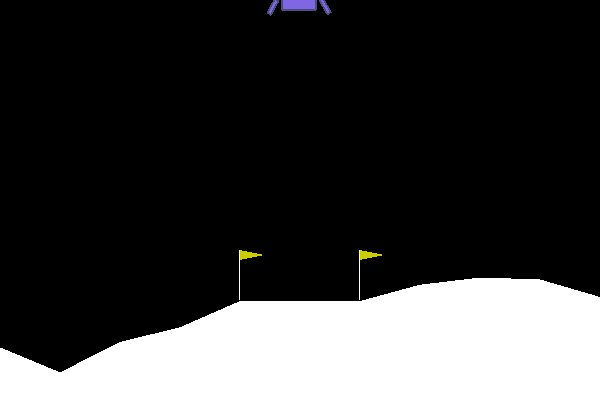
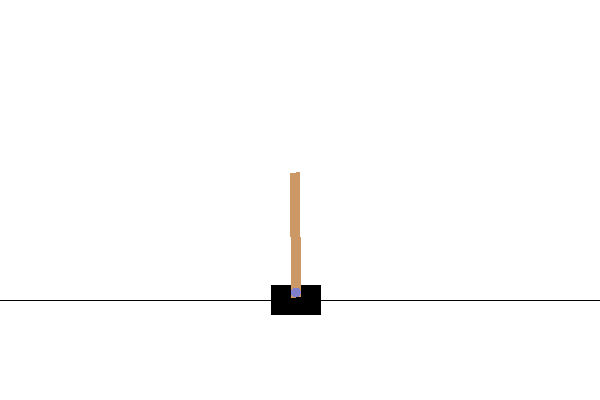

# Reinforcement Learning
 
The full project is explained [here](https://apiquet.com/2021/02/07/reinforcement-learning/)

qlearning_FrozenLake.ipynb notebook explore q-learning technique in FrozenLake openai gym environment:

A neural network was also used to teach an agent to land on a specific position. The following agent was trained for 3k episodes:

The same architecture was used in the CartPole openai gym environment where a pole is attached by an un-actuated joint to a cart, which moves along a frictionless track:

The architecture and methods of the agent have been designed to adapt to other open gym environments.
