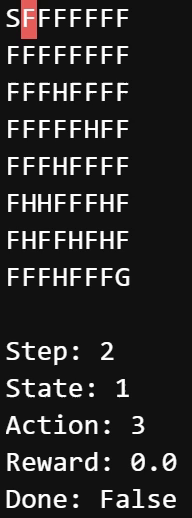
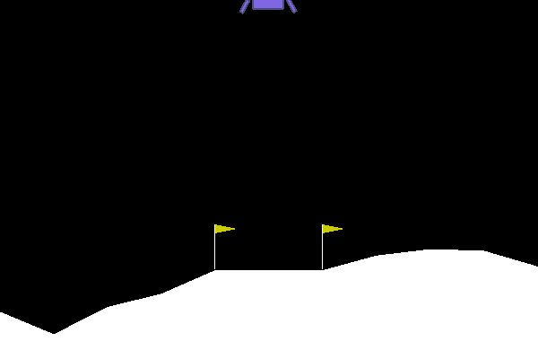

# Reinforcement Learning
 
The full project is explained [here](https://apiquet.com/2021/02/07/reinforcement-learning/)

qlearning_FrozenLake.ipynb notebook explore q-learning technique in FrozenLake openai gym environment:

A neural network was also used to teach an agent to land on a specific position:

